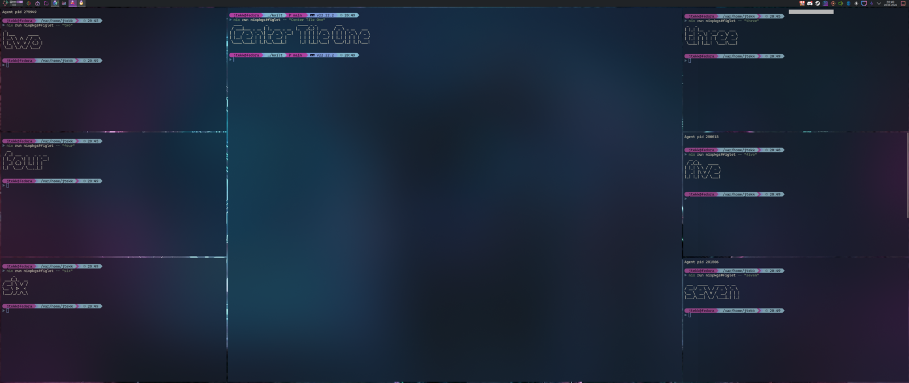
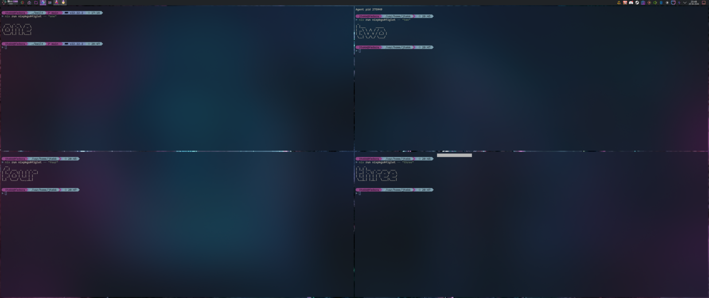
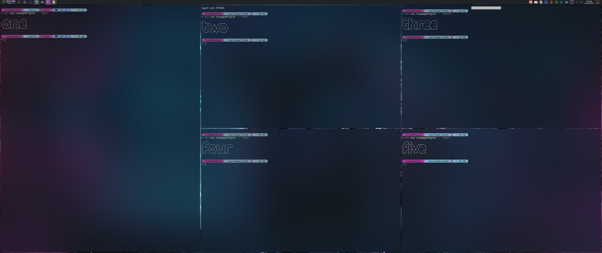
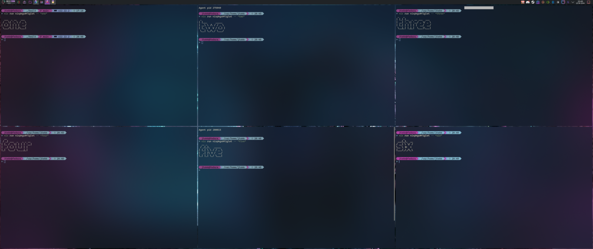

# Kwilt

Personal KWin tiling script.

## Screenshots

**centerTile, N=7** — center column wide; left and right columns each in thirds.



**autoGrid, N=4** — clockwise quartered (TL → TR → BR → BL).



**autoGrid, N=5** — W1 spans the full left column; W2…W5 fill the right 2×2 block (signature smooth transition between the 2×2 and 2×3 perfect grids).



**autoGrid, N=6** — perfect 2×3 grid, row-major.



## Layouts

Six layouts are implemented. Choose the default via `Layout` in the config UI (System Settings → Window Management → KWin Scripts → Kwilt → Configure), or via `kwriteconfig6 --file kwinrc --group Script-kwilt --key Layout <name>`. Set on the active (output, virtualDesktop) at runtime via the layout shortcuts (`Meta+Ctrl+G/C/M/D/L/T`) or cycle with `Meta+Ctrl+Shift+L`.

### `centerTile` (default; cap = 9)

Center column at `MasterWidth` fraction of the work area (default `0.5`), side columns share the remainder equally at `(1 - MasterWidth) / 2` each (default `0.25`). Sides grow downward as windows are added; when side counts are uneven, **left fills first**.

| N | Layout |
|---|---|
| 1 | full work area |
| 2 | left half / right half (intentional break from center+side) |
| 3 | left 25% / center 50% / right 25% (defaults) |
| 4 | center / left split 1/2 height / right full / left-bot |
| 5 | center / left 1/2 / right 1/2 / left-bot / right-bot |
| 6 | center / left 1/3 / right 1/2 / left-mid / right-bot / left-bot |
| 7 | center / left 1/3 / right 1/3 / left-mid / right-mid / left-bot / right-bot |
| 8 | center / 4 left (quarters) / 3 right (thirds) — asymmetric, left fills first |
| 9 | center / 4 left (quarters) / 4 right (quarters) |
| 10+ | oldest knocked out — visible cap is 9 (`CapCenterTile = 0` also falls back to 9; geometry defined for N=1..9) |

### `autoGrid` (cap = 12)

Pattern: while N is below the next perfect grid (2x2, 2x3, 3x3, 3x4), W1 spans the full left column; once N hits the perfect grid, every cell equalizes.

| N | Layout |
|---|---|
| 1 | full work area |
| 2 | left half / right half |
| 3 | 2x2 frame; W1 spans full left column |
| 4 | TL / TR / BR / BL (clockwise — intentional break from row-major) |
| 5 | 2x3 frame; W1 spans full left column, W2..W5 fill the right 2x2 |
| 6 | 2x3 grid (row-major) |
| 7 | 3x3 frame; W1 spans full left column, W2..W7 fill the right 2x3 |
| 8 | 3x3 frame; W1 spans top 2 rows of left column, bottom row is a normal 3-cell strip |
| 9 | 3x3 grid (row-major) |
| 10 | 3x4 frame; W1 spans full left column, W2..W10 fill the right 3x3 |
| 11 | 3x4 frame; W1 spans top 2 rows of left column, bottom row is a normal 4-cell strip |
| 12 | 3x4 grid (row-major) |
| 13+ | oldest is knocked out (minimized) — visible cap is 12 |

### `monocle` (cap = 1)

One window visible at full work area; everything else is knocked out. Alt-tab onto a knocked window to promote it. Useful for focus mode / presentations.

| N | Layout |
|---|---|
| 1 | full work area |
| 2+ | one visible, all others knocked out (alt-tab cycles) |

### `dual` (cap = 2)

At most two windows visible, side-by-side. Adding a 3rd window knocks out the oldest. Useful for diff views, paired apps, doc + IDE.

| N | Layout |
|---|---|
| 1 | full work area |
| 2 | left half / right half |
| 3+ | oldest is knocked out — visible cap is 2 |

### `leftTile` (cap = 9 default, tunable)

Master column anchored to the **left** at `MasterWidth` fraction (default `0.5`); non-master area to the right. Column count in the non-master area is `NonMasterColumns`: `1` = single wide column with equal-height rows; `2` = inner + outer columns with the 2-column fill order below. `0` (default) picks automatically — ultrawide monitors (aspect ratio > 2:1) get 2 columns, everything else gets 1.

**2-column fill order** — outer column grows first each pair. Non-master 1 goes to inner-row-1, non-master 2 to outer-row-1, then odd non-masters land in the outer column (row `ceil(k/2)`) and even non-masters in the inner column (row `k/2`). Row counts: `inner = floor(n_nm/2)`, `outer = ceil(n_nm/2)`.

| N | 1 non-master col | 2 non-master cols |
|---|---|---|
| 1 | full work area | full work area |
| 2 | master / non-master (50/50) | master / non-master (full-height single column) |
| 3 | master / 2 non-master rows | master / inner (full) / outer (full) — 50/25/25 |
| 4 | master / 3 non-master rows | master / inner (full) / outer split 2 rows |
| 5 | master / 4 non-master rows | master / inner split 2 rows / outer split 2 rows |
| 6 | master / 5 non-master rows | master / inner 2 rows / outer 3 rows |
| 7 | master / 6 non-master rows | master / inner 3 rows / outer 3 rows |
| 8 | master / 7 non-master rows | master / inner 3 rows / outer 4 rows |
| 9 | master / 8 non-master rows | master / inner 4 rows / outer 4 rows |
| 10+ | oldest is knocked out — visible cap is `CapLeftTile` (default 9; `0` = unlimited) |

### `rightTile` (cap = 9 default, tunable)

Mirror of `leftTile` — master column anchored to the **right**; non-master area (with the same 1- or 2-column rules) to the left. All spec details identical to `leftTile` with the horizontal axis flipped.

### Shared behavior

- Only `normalWindow` top-levels tile. Dialogs, popups, fullscreen, multi-desktop windows stay floating.
- Activating a knocked-out window (alt-tab onto it) promotes it back into the visible set; the new-oldest is knocked out in its place.
- Dragging a tiled window onto another tile swaps them. Drag onto empty/own tile or resize → snap back.
- **Layout is per-(output, virtualDesktop)**. The layout shortcuts (cycle + direct-set) act on the (output, virtualDesktop) of the currently active window — different monitors and different virtual desktops keep independent layouts. New (output, virtualDesktop) combos inherit the `Layout` config default. Per-key overrides are session-only and reset on script reload.

## Configuration

Two equivalent paths — both read/write `~/.config/kwinrc` under `[Script-kwilt]`.

**GUI** — System Settings → Window Management → KWin Scripts → click the gear icon next to *Kwilt* (or the *Configure* button, depending on Plasma version). Form built from `contents/ui/config.ui` against the kcfg schema in `contents/config/main.xml`. **Apply** writes the kwinrc keys; values take effect on the next script reload (toggle Kwilt off and on in the same dialog, or relogin).

**CLI / scriptable** — change values directly and reload:

| Key | Type | Default | Range | Notes |
|---|---|---|---|---|
| `Layout` | string | `centerTile` | `centerTile` / `autoGrid` / `monocle` / `dual` / `leftTile` / `rightTile` | Default layout for new (output, virtualDesktop) combos. Runtime per-key overrides via `Meta+Ctrl+G/C/M/D/L/T` and cycle via `Meta+Ctrl+Shift+L` act on the active (output, virtualDesktop) only. |
| `CapAutoGrid` | int | `12` | `0`–`12` | Visible cap before knockout in autoGrid. `0` = unlimited; falls back to `12` (geometry defined for N=1..12). |
| `CapCenterTile` | int | `9` | `0`–`9` | Visible cap before knockout in centerTile. `0` = unlimited; falls back to `9` (geometry defined for N=1..9). |
| `CapLeftTile` | int | `9` | `0`–`12` | Visible cap before knockout in leftTile. `0` = unlimited — leftTile scales to arbitrary N. |
| `CapRightTile` | int | `9` | `0`–`12` | Visible cap before knockout in rightTile. `0` = unlimited — rightTile scales to arbitrary N. |
| `MasterWidth` | float | `0.5` | `0.15`–`0.85` | Master column width as fraction of the work area. Applies to `centerTile` (N≥3, sides derive as `(1 - MasterWidth) / 2` each), `leftTile` (N≥2), `rightTile` (N≥2). At N=1 every layout fills the work area. |
| `NonMasterColumns` | int | `0` | `0`–`2` | Non-master column count for `leftTile` / `rightTile`. `0` = auto (aspect ratio > 2:1 → 2 columns; else 1). `1` or `2` = explicit override. `centerTile` ignores this — its column layout is intrinsic. |
| `OuterGap` | int | `0` | `0`–`80` | Pixels between any tile edge and the work area edge. `0` = flush to the screen. |
| `InnerGap` | int | `0` | `0`–`80` | Pixels between adjacent tiles. Split halved on each side; odd values round consistently so adjacent gaps sum exactly. |
| `BorderlessWhenTiled` | bool | `false` | `true` / `false` | Hide window decorations on visible tiles by setting `noBorder`. Original border state is saved per-window and restored on untrack/close/fullscreen. |
| `AlwaysFloat` | string | `""` | comma-separated | Substrings matched (case-insensitive) against each window's `resourceClass` and `resourceName`. Matches are never tiled (e.g. `kcalc, pavucontrol, plasma-systemmonitor`). |

Set via:

```sh
kwriteconfig6 --file kwinrc --group Script-kwilt --key Layout leftTile
kwriteconfig6 --file kwinrc --group Script-kwilt --key MasterWidth 0.6
./dev-reload.sh
```

Out-of-range values are clamped to the listed range. Invalid `Layout` strings fall back to `centerTile`.
- Geometry snaps. Visual transitions rely on KDE's built-in desktop effects (System Settings → Workspace Behavior → Desktop Effects).

## Install

**As a user — packaged release.** Grab the latest `.kwinscript` from the [Releases tab](../../releases) and install it:

```sh
kpackagetool6 -t KWin/Script -i kwilt-*.kwinscript
```

Then enable in **System Settings → Window Management → KWin Scripts** and run `scripts/setup-shortcuts.sh` once to seed app-launcher bindings + clear conflicting Plasma defaults.

**As a developer — repo symlink** for fast inner-loop iteration:

```sh
mkdir -p "$HOME/.local/share/kwin/scripts"
ln -s "$PWD" "$HOME/.local/share/kwin/scripts/kwilt"
```

The repo symlink and the `kpackagetool6` install **conflict** at the same path — `scripts/install-local.sh` refuses to clobber the symlink. Pick one mode at a time.

## Dev loop

```sh
./dev-reload.sh          # reload with current LAYOUT
./dev-reload.sh grid     # switch to autoGrid, then reload
./dev-reload.sh center   # switch to centerTile, then reload
./dev-stop.sh            # stop and unload
```

`dev-reload.sh` with a layout argument sed-rewrites the `LAYOUT` declaration in `main.js`, then reloads — so the source reflects the boot default (and `git diff` shows what you last ran). Runtime switching is via the `Meta+Ctrl+Shift+L` shortcut.

Important: KWin's `loadScript` over D-Bus **registers but doesn't start** the script — `run` must be called on the per-script object. `dev-reload.sh` handles this; `dev-stop.sh` calls `unloadScript`, which stops and removes in one call.

## Logs

```sh
journalctl -f QT_CATEGORY=js QT_CATEGORY=kwin_scripting
```

Look for `[kwilt]` lines. The KWin Scripting Console (`Alt+F2` → `wm console`) is also available for one-off experiments; its output goes to the same journal stream.

## Known gaps

- Knocked-out pile has no tab UI yet (needs a companion Plasma/Quickshell widget — KWin scripts can't render arbitrary UI).

## Shortcuts

Kwilt registers its **window-management** shortcuts directly. **App launchers** live in KDE's native Custom Shortcuts mechanism — KWin scripts can't spawn processes (no exec API; `callDBus` → systemd-run can't marshal the nested-variant `ExecStart` arg cleanly). Both are configured in one shot by `scripts/setup-shortcuts.sh`, which:

1. Disables Plasma KWin defaults that collide with Kwilt's bindings (Quick Tile on `Meta+arrows`, Move Window to Screen on `Meta+Shift+Left/Right`, and the `Meta+Tab` half of Walk Through Windows — `Alt+Tab` is preserved).
2. Installs hidden `.desktop` files under `~/.local/share/applications/kwilt-spawn-*.desktop` for each launcher.
3. Binds each `.desktop` to a key via `~/.config/kglobalshortcutsrc`.

Run it once after installing the script package:

```sh
./scripts/setup-shortcuts.sh
```

Re-runnable safely. After running, log out and back in once if a shortcut doesn't fire — `kglobalaccel` sometimes needs the session restart to pick up new bindings.

### Window management (in main.js)

| Default | Action |
|---|---|
| `Meta+Ctrl+Shift+L` | Cycle layout on the active (output, virtualDesktop): autoGrid → centerTile → monocle → dual |
| `Meta+Ctrl+G` | Set layout on active (output, virtualDesktop): autoGrid |
| `Meta+Ctrl+C` | Set layout on active (output, virtualDesktop): centerTile |
| `Meta+Ctrl+M` | Set layout on active (output, virtualDesktop): monocle |
| `Meta+Ctrl+D` | Set layout on active (output, virtualDesktop): dual |
| `Meta+Ctrl+L` | Set layout on active (output, virtualDesktop): leftTile |
| `Meta+Ctrl+T` | Set layout on active (output, virtualDesktop): rightTile (T because Meta+Ctrl+R is claimed by Spectacle's Rectangular Region screenshot) |
| `Meta+S` | Toggle master pin on active window (claims the master slot on its output/desktop; session-only) |
| `Meta+Ctrl+Shift+R` | Rebuild tile queues from current windows (ghost-slot recovery) |
| `Meta+Left/Right/Up/Down` | Focus tile in that direction |
| `Meta+Shift+Left/Right/Up/Down` | Swap focused window with neighbor in that direction |
| `Meta+Tab` | Cycle focus through visible tiles |
| `Meta+U` | Focus most-recently-focused window (toggle) |

Rebind in **System Settings → Shortcuts → KWin** (search for `Kwilt:`).

### App launchers (via setup-shortcuts.sh)

| Default | Action |
|---|---|
| `Meta+Return` | `kitty` |
| `Meta+Shift+Return` | `foot -c $HOME/.config/ThemeSwitcher/foot.ini` |
| `Meta+/` | `bitwarden` |
| `Meta+Shift+B/F/H/I/M/N/T/U/W/Y` | btop / spf / htop / impala / spotify / nvim / helium / bluetui / wiremix / yazi (kitty-wrapped where applicable) |
| `Meta+Alt+A/D/G/N/U/Y` | Helium webapps: Audible / Discord / Gemini / Netflix / Upwork / YouTube |
| `Ctrl+Shift+Space` | Nerd Fonts cheatsheet (Helium webapp) |

Rebind in **System Settings → Shortcuts → Custom Shortcuts** (entries named `Kwilt: …`). To remove all launcher bindings, delete the `kwilt-spawn-*.desktop` files and the matching groups in `kglobalshortcutsrc`.
